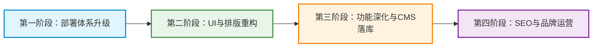

# 栩文科技 (graddu.com) 官方门户网站深度扫描与优化建议报告

> **生成时间**：2026-09-23  
> **项目路径**：`D:\graddu`  
> **服务域名**：`www.graddu.com` / `graddu.com`  
> **文档位置**：`docs/WEBSITE_ANALYSIS_AND_IMPROVEMENTS.md`

---

## 目录
- [一、 工程架构与已有功能扫描](#一-工程架构与已有功能扫描)
  - [1.1 总体架构概览](#11-总体架构概览)
  - [1.2 前台用户端功能列表](#12-前台用户端功能列表)
  - [1.3 后台管理端功能列表](#13-后台管理端功能列表)
  - [1.4 后端服务与核心接口](#14-后端服务与核心接口)
- [二、 UI 视觉与排版优化分析](#二-ui-视觉与排版优化分析)
  - [2.1 整体品牌视觉与主题](#21-整体品牌视觉与主题)
  - [2.2 导航栏 (SiteHeader) 排版问题](#22-导航栏-siteheader-排版问题)
  - [2.3 首页 (HomeView) 布局与内容丰富度](#23-首页-homeview-布局与内容丰富度)
  - [2.4 页脚 (SiteFooter) 结构完善](#24-页脚-sitefooter-结构完善)
- [三、 门户网站缺陷诊断与完善建议](#三-门户网站缺陷诊断与完善建议)
  - [3.1 信息架构与内容深度缺陷](#31-信息架构与内容深度缺陷)
  - [3.2 软件下载中心缺陷与优化](#32-软件下载中心缺陷与优化)
  - [3.3 客户留资与互动转化缺陷](#33-客户留资与互动转化缺陷)
  - [3.4 SEO、安全与合规缺陷](#34-seo安全与合规缺陷)
  - [3.5 移动端与响应式适配缺陷](#35-移动端与响应式适配缺陷)
- [四、 下一步落地演进路线图 (Roadmap)](#四-下一步落地演进路线图-roadmap)

---

## 一、 工程架构与已有功能扫描

### 1.1 总体架构概览
工程采用前后端分离的经典企业级架构：
- **前端技术栈**：Vue 3 + Vite + Vue Router，单页面应用 (SPA)。
  - 源码位置：`official-website-frontend/`
  - 依赖轻量，自研轻量 CSS（`style.css`）实现商务与可爱双主题切换。
  - 构建产物通过 Nginx 静态文件托管。
- **后端技术栈**：Spring Boot 3.5.0 + Spring Security + Spring JDBC + MySQL + OpenAPI (Swagger)，JDK 17。
  - 源码位置：根目录下 `src/` 与 `pom.xml`（artifactId: `official-website-backend`）。
  - 支持文件分片断点续传（HTTP Range Header）。
  - 安全模块通过 Spring Security JDBC 数据源固化管理员账号密码。

### 1.2 前台用户端功能列表
| 页面 / 路由 | 核心功能 | 当前实现状态 |
| :--- | :--- | :--- |
| **首页 (`/`)** | 品牌定位标语 Hero、四大核心技术 3 栏轮播展示、点击卡片直达方案详情 | ✅ 已实现基础轮播与跳转；页面内容偏少 |
| **公司概况 (`/company`)** | 公司简介、成立时间/地点、核心聚焦业务说明 | ✅ 纯文本展示，排版极简 |
| **技术方案 (`/solutions`)** | WebRTC 实时互动、远程桌面支持、实时弹幕系统、AI 实时交互 4 大方案切换查看 | ✅ 交互可用，支持轮播选中联动详情 |
| **实时要闻 (`/news`)** | 官方动态、技术方案升级公告列表 | ✅ 对接 `/api/news` 接口渲染，带降级模拟数据 |
| **软件下载 (`/downloads`)** | Penclaw 远程支持工具等软件包列表、版本号、更新日期、下载按钮 | ✅ 对接后端下载列表，支持断点续传与大文件分片 |
| **关于我们 (`/about`)** | 企业地址展示、二维码占位、客户意向在线需求表单提交 | ✅ 表单可提交至 `/api/contact`；二维码目前为文字占位 |
| **全局主题切换** | 顶部提供“商务”与“可爱”主题一键切换 | ✅ 基于 DOM `data-theme` 属性与 LocalStorage 切换生效 |

### 1.3 后台管理端功能列表
| 页面 / 路由 | 核心功能 | 当前实现状态 |
| :--- | :--- | :--- |
| **控制台登录 (`/console/login`)** | 管理员账号密码登录，获取会话并写入本地鉴权缓存 | ✅ 对接 Spring Security 鉴权验证 |
| **下载包管理 (`/console/downloads`)** | 软件安装包多文件上传（支持 up to 300MB）、版本号设置、下载链接自动生成、项删除 | ✅ 完整实现文件上传、列表与删除 |
| **新闻管理 (`/console/news`)** | 官网新闻公告内容维护 | ⚠️ 占位视图（暂未对接发布与富文本编辑） |
| **主题配置 (`/console/theme`)** | 网站前台默认主题配置 | ⚠️ 占位视图 |
| **密码修改 (`/console/password`)** | 管理员修改当前登录密码并同步更新数据库 | ✅ 完整实现旧密码校验与新密码写入 |

### 1.4 后端服务与核心接口
- `GET /api/news`：获取新闻公告列表（当前为控制器内静态列表）。
- `GET /api/downloads`：获取对外公开的安装包列表。
- `GET /api/downloads/{id}/download`：支持 **HTTP Range** 分块流式下载，支持断点续传与迅雷/浏览器原生多线程下载。
- `POST /api/downloads` / `DELETE /api/downloads/{id}`：安装包上传管理（需管理员角色）。
- `POST /api/contact`：接收用户需求留言。
- `POST /api/auth/login`、`GET /api/auth/me`、`POST /api/auth/change-password`：基于 MySQL `users` & `authorities` 表的标准认证与密码管理。

---

## 二、 UI 视觉与排版优化分析

### 2.1 整体品牌视觉与主题
1. **主基调优化**：
   - 当前企业官网面向 B 端客户与技术合作伙伴，主推“AI × 音视频”高科技方案。
   - 现有的“可爱 (cute)”主题（粉紫渐变、圆角气泡）对于严肃的 SaaS 与音视频技术官网略显违和，建议将其改造为 **“深色极客模式 (Dark / Tech Mode)”** 与 **“清爽科技白 (Light Mode)”**，更符合 IT、AI、音视频领域的高级质感。
2. **Hero 区视觉层级单薄**：
   - 首页首屏缺少具有科技感的视觉焦点（如：动态粒子背景、波浪线条、系统架构动态示意图、或高保真终端运行界面截图）。
   - 标语下方缺少强力的 **CTA (Call-to-Action) 行动按钮组**，例如：“预约产品演示”、“立即体验 Penclaw”、“查看在线文档”。

### 2.2 导航栏 (SiteHeader) 排版问题
1. **层级扁平化**：
   - 当前导航所有项横向平铺（首页、公司概况、技术方案、实时要闻、软件下载、关于我们、主题切换）。
   - 行业主流规范建议：
     - **解决方案**：支持悬浮下拉二级菜单（WebRTC 方案、远程桌面协同、高并发弹幕、AI 智能交互）。
     - **产品与下载**：将 Penclaw 等核心产品独立归类。
     - **右侧操作区**：放置“技术支持 / 联系销售”高亮按钮，并提供 GitHub / 控制台入口。
2. **移动端响应式缺失**：
   - 窄屏（手机、平板）下导航栏链接过多，在 `@media` 屏幕宽度缩小时会换行堆叠，造成 Header 撑高、遮挡首屏内容。
   - 必须引入 **移动端汉堡折叠菜单 (Mobile Drawer / Hamburger Menu)**，点击展开侧边或全屏抽屉导航。

### 2.3 首页 (HomeView) 布局与内容丰富度
当前首页仅有一个 Banner 和一个 3UpCarousel 轮播，内容量偏少，建议补充以下版块：
1. **数据与能力指标看板 (Metrics)**：
   - 毫秒级端到端延迟（< 150ms）、99.99% 高可用架构、亿级弹幕并发吞吐、多端全平台覆盖（Windows / macOS / Linux / Android / Web）。
2. **技术架构图解 / 核心优势对比 (Why Choose Us)**：
   - 自研编解码与穿透技术 vs 传统方案的优势矩阵对比。
3. **典型应用场景 (Use Cases)**：
   - 视频会议、远程运维协同、游戏互动直播、智能 AI 语音客服。
4. **客户与生态合作伙伴 Logo 墙**：
   - 增强品牌公信力与合作背书。
5. **最新动态与博客快速导流**：
   - 在首页展示最新的 3 条新闻或技术专栏，附带阅读更多。

### 2.4 页脚 (SiteFooter) 结构完善
1. **分列式信息流**：
   - 现页脚分为两列，建议扩充为 4 列布局：
     - 列 1：公司品牌与愿景描述、社交网络图标；
     - 列 2：技术方案快捷通道（WebRTC、远程桌面、弹幕引擎、AI 服务）；
     - 列 3：资源与支持（Penclaw 客户端、开发文档、更新日志、API 接口）；
     - 列 4：商务合作与联系方式（客服电话、企业邮箱、办公地址、企业二维码与技术交流群）。
2. **资质与合规信息**：
   - 目前已包含 `浙ICP备2021037087号-1`。
   - 需规范增加：**全国公安机关互联网站安全管理服务平台备案号**（若已办理）、《隐私政策》和《服务条款》外链。

---

## 三、 门户网站缺陷诊断与完善建议

### 3.1 信息架构与内容深度缺陷
1. **“公司概况”页面内容单薄**：
   - 目前仅有两行文字，无法支撑一家科技公司的形象。
   - **完善建议**：增加**“发展历程时间轴 (Milestones)”**、**“核心团队与技术积淀”**、**“技术研发理念”**与**“资质荣誉”**。
2. **“技术方案”缺少架构与落地深度**：
   - 缺少架构图展示，缺少技术细节参数（协议栈：SRTP/ICE/STUN/TURN、编解码：H.264/AV1/Opus 等）。
   - **完善建议**：为每个技术方案配图，提供“方案白皮书下载”或“在线咨询”浮窗。
3. **“实时要闻”缺少详情页与分类**：
   - 目前点击卡片无法查看全文。
   - **完善建议**：增加 `/news/:id` 详情页，引入 Markdown 渲染支持，方便发布产品发版日志或深度技术文章。

### 3.2 软件下载中心缺陷与优化
1. **下载项信息维度不足**：
   - 当前仅展示软件名称、版本、更新时间。
   - 缺乏：**适用操作系统**（Windows 64位/macOS Apple Silicon/Intel/Linux deb/rpm）、**文件大小**、**SHA256 校验和**、**更新日志 (Release Notes)**。
2. **下载引导与用户保障**：
   - 缺少安装教程或常见问题指引（如：Windows SmartScreen 拦截提示解决办法、macOS 签名公证说明）。
   - 缺少历史版本归档下载。

### 3.3 客户留资与互动转化缺陷
1. **关于我们页面的留资表单**：
   - 缺少图形验证码或滑块校验，易被爬虫接口恶意刷垃圾留言。
   - 提交成功后缺乏友好的 Toast 反馈或处理时效承诺（如“我们将在 2 小时内由技术专家与您联系”）。
   - 后端目前接收到表单后仅在控制台打印，未入库，也未接入企业微信/钉钉群机器人 Webhook 或邮件通知。
2. **二维码缺乏真实图片**：
   - 页面中目前直接渲染纯文本“企业二维码”、“QQ二维码”，破坏页面可信度。需要尽快上传真实的客服二维码与微信群图片。
3. **缺少全局右侧悬浮挂件 (Sticky Float Widget)**：
   - 建议在全站右下角增加悬浮挂件：包含“在线微信客服”、“电话直呼”、“返回顶部”按钮。

### 3.4 SEO、安全与合规缺陷
1. **SEO (搜索引擎优化) 缺失**：
   - `index.html` 的 `<title>` 目前是通用占位符，缺少关键词（Keywords: WebRTC, 远程桌面, 杭州栩文科技, 实时互动音视频, AI实时交互）与描述（Description）。
   - SPA 单页应用不利于百度/谷歌抓取，后续建议配置 `robots.txt`、`sitemap.xml`，以及 Open Graph 社交分享卡片标签（`og:title`, `og:image` 等）。
2. **合规与法律文档**：
   - 缺失《隐私政策声明 (Privacy Policy)》和《用户服务协议 (Terms of Service)》，这在申请软件著作权、域名认证、客户端发版时是刚性合规要求。

### 3.5 移动端与响应式适配缺陷
- 轮播图在手机端宽度受限，需确保触摸滑动顺畅；
- 表格和卡片在小屏幕上应自动切换为单列垂直流；
- 按钮触控区域需保证至少 44px × 44px，提升移动端操作体验。

---

## 四、 下一步落地演进路线图 (Roadmap)

### 4.1 第一阶段：部署体系升级与双域名绑定 (已实施完成)
- [x] 将阿里云自动化部署脚本改造为适配 `www.graddu.com` 与 `graddu.com`；
- [x] 规范系统服务为 `graddu-website`，端口设置为独立端口（8082）；
- [x] 配置 Nginx HTTP 全站 301 自动跳转 HTTPS，整合大文件 350M 上传与断点续传；
- [x] 实现全自动化编译（Maven + Vite）与免密一键上线。

### 4.2 第二阶段：UI 视觉焕新与排版升级 (近期目标)
- [ ] **重构 SiteHeader**：增加移动端汉堡抽屉菜单，增加“技术咨询”CTA 按钮；
- [ ] **焕新首页首屏 (Hero)**：科技深色感/清爽科技白双模，增加核心指标看板与场景板块；
- [ ] **方案与下载页重构**：技术方案增加架构参数，下载中心增加系统平台 Tab 筛选与 SHA256 校验和展示；
- [ ] **增加右侧悬浮工具条**：扫码咨询、企业微信直达、一键回到顶部。

### 4.3 第三阶段：后台 CMS 完善与全动态数据驱动
- [ ] 将新闻动态、解决方案内容从前端写死迁移至 MySQL 数据库存储；
- [ ] 在 `/console` 后台实现新闻富文本/Markdown 编辑与发布；
- [ ] 完善客户留资（Contact）后台列表查看，接入钉钉/飞书机器人即时提醒；
- [ ] 增加下载量统计与访问日志简易分析。

### 4.4 第四阶段：SEO、合规与性能优化
- [ ] 规范全站 TDK（标题、描述、关键词）与 OpenGraph 标签；
- [ ] 补充生成 `robots.txt` 与 `sitemap.xml`；
- [ ] 上线《隐私保护指引》与《服务协议》页面，补充公安备案编号。
